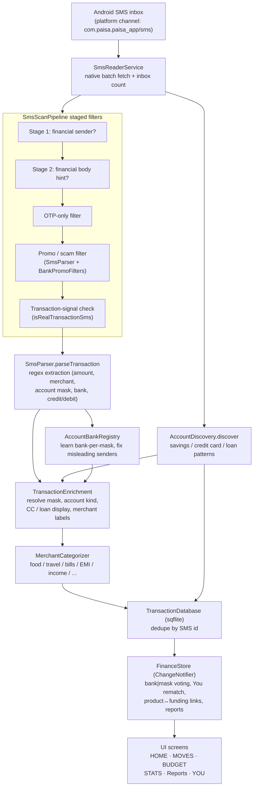

# Paisa

**Paisa** is a Flutter personal‑finance app that turns your Android SMS inbox into a complete picture of your money. It reads bank and UPI alert messages **on‑device**, automatically parses them into transactions, discovers your bank accounts, credit cards and loans, classifies each one, and surfaces spending insights, budgets and reports — with **zero manual entry**.

It is purpose‑built for **Indian banks and payment providers** (HDFC, SBI, ICICI, Axis, Kotak, IDFC, PNB, Federal/Fi/Jupiter, Yes Bank, IndusInd, BOB, HSBC, Slice, and the major wallets/UPI apps).

> **Private / personal project.** This is a personal-use application. No SMS content, account masks, or other personal data is committed to this repository. All SMS parsing happens locally on the device.

> **AI agents:** see [`AGENTS.md`](AGENTS.md) for an AI-oriented project context & handoff (architecture, history of what's been tried, known issues, conventions).

---

## Table of contents

- [Features](#features)
- [Architecture](#architecture)
  - [Data-flow diagram](#data-flow-diagram)
  - [Layer-by-layer](#layer-by-layer)
  - [Schema versioning & re-scans](#schema-versioning--re-scans)
- [Banks & institutions covered](#banks--institutions-covered)
- [Account classification logic](#account-classification-logic)
- [Implementation details](#implementation-details)
- [Getting started / build](#getting-started--build)
- [Testing](#testing)
- [Project structure](#project-structure)
- [Privacy](#privacy)

---

## Features

- **Full SMS history scan** — the first launch reads the **entire** SMS inbox (no time window), so years of history are captured. Subsequent launches do fast incremental scans of only new messages.
- **Automatic transaction parsing** — a staged filter + regex pipeline extracts amount, debit/credit direction, merchant/payee, bank and masked account from each alert. No manual entry.
- **Account discovery & classification** — savings accounts, credit cards and loans are detected from your SMS and grouped by bank + masked last‑4, each classified by a balanced per‑account voting rule.
- **Dashboard (Home)** — greeting, current‑month spend/income (KPIs exclude internal movement), **tappable** category chips → this month’s category list, Today / This‑month rows.
- **Moves** — searchable, category‑filtered, date‑grouped transaction list with sorting.
- **Budgets** — **user‑editable** per‑category limits (seeded once from history, then owned by the user; progress can exceed 100%). Not a circular `spent × 1.3` formula.
- **Stats** — spending charts, Home‑style category **stickers** (rim arc + TOP/mid/LOW % badges), top merchants, daily average, highest‑spend day, food‑spend trend.
- **Reports** — date‑range reports (presets + custom) with the same sticker grid and category / merchant / income drill‑downs.
- **Sorting** — every transaction list supports Newest/Oldest (date) and High→Low / Low→High (amount) via a shared control.
- **Filtering** — drill into a category, merchant, income source, or a **You** account (loan drilldown includes associated EMI without double‑counting a product SMS + funding debit).
- **You** — detected accounts with All / Savings / Credit card / Loan filters, ownership rematch, editable local profile, **Rescan SMS**, privacy + help settings (**no** notification toggles).
- **Exact INR** — all amounts use `en_IN` currency with **two decimal digits** (no whole‑rupee roundoff).
- **On-device SQLite storage** — parsed transactions are deduplicated by SMS id and persisted locally with `sqflite` (plaintext; biometric lock / SQLCipher are not shipped).

---

## Architecture

Paisa uses a **layered architecture** with clear separation between the SMS ingestion pipeline, state management, data models, and UI.

- **State management:** [`provider`](https://pub.dev/packages/provider) with `ChangeNotifier`. The app is wrapped in a `MultiProvider` (see `main.dart`) exposing `FinanceStore` (all finance data + derived analytics) and `AppSettings`. Screens read state via `Consumer`/`context.watch`/`context.read` and rebuild reactively when the store calls `notifyListeners()`.
- **On-device only:** the SMS pipeline, parsing, classification, and database all run locally on the phone. There is no backend or network sync.

### Data-flow diagram



### Layer-by-layer

#### `lib/screens/` — UI

| Screen | Purpose |
| --- | --- |
| `main_shell.dart` | Bottom-nav shell: **HOME / MOVES / BUDGET / STATS / YOU**. Tabs are **lazy keep-alive** (built on first visit, kept offstage). Launch scan runs after first frame, not here. |
| `dashboard_screen.dart` | Home: greeting, current-month spend/income, **tappable** category chips, Today / This-month previews. |
| `transactions_screen.dart` | Moves: full list with search, category filters, date grouping and sort. |
| `budgets_screen.dart` | User-editable per-category budget limits with progress bars (can exceed 100%). |
| `insights_screen.dart` | Stats: charts + Home-style category sticker grid (rim arc, TOP/mid/LOW %). |
| `reports_screen.dart` | Date-range reports (presets + custom) with the same sticker grid and drill-downs. |
| `category_transactions_screen.dart` | Debit list for one category (wrapper over `FilteredTransactionsScreen`). |
| `filtered_transactions_screen.dart` | Category, merchant, income source, or **You-account** drilldown (optionally date-bounded). |
| `profile_screen.dart` | You: accounts with All/Savings/Credit-card/Loan filters, rematch, Rescan SMS, privacy/help. |
| `edit_profile_screen.dart` | Edit locally-stored name/email. |
| `onboarding/welcome_screen.dart` | First-run welcome. |
| `onboarding/profile_setup_screen.dart` | Collects on-device profile details (name + optional email). |
| `onboarding/sms_permission_screen.dart` | Explains and requests SMS permission. |
| `onboarding/ready_screen.dart` | Onboarding completion / hand-off to the main shell. |
| `settings/privacy_settings_screen.dart` | Privacy controls (incl. clearing local data). |
| `settings/help_support_screen.dart` | Help & support. |

#### `lib/widgets/` — reusable widgets

`paisa_bottom_nav.dart` (HOME / MOVES / BUDGET / STATS / YOU), `transaction_row.dart`, `grouped_transaction_list.dart`, `transaction_sort_control.dart`, `category_spend_chip.dart` (Home chips + Stats/Reports `CategorySpendStickerGrid` with rim arc and TOP/mid/LOW badges), `paisa_progress_bar.dart`, `gradient_button.dart`, `bank_logo.dart`, and `settings_detail_scaffold.dart`.

#### `lib/providers/` — state management

- `finance_store.dart` — the central `FinanceStore extends ChangeNotifier`. Owns transactions and discovered accounts, orchestrates scans (`syncFromSms`, `fullRescanFromSms`, re-entrancy-guarded `_runSync`), and exposes analytics (monthly/insights spend, budgets, top merchants, `buildReport`, memoized `bankAccounts()` / `_ledgerAccountBuckets()`). Balanced `bank|mask` kind voting, You rematch + loan association, product↔funding links (no double-count), throttled `scanProgressListenable`.
- `app_settings.dart` — user/app preferences persisted via `shared_preferences`.

#### `lib/services/sms/` — the SMS pipeline

End-to-end flow: **raw SMS → filters → parse → enrich → discover → store**.

| File | Role |
| --- | --- |
| `sms_reader_service.dart` | Talks to Android over the `com.paisa.paisa_app/sms` `MethodChannel`; batches inbox reads (default 500), tracks progress/checkpoints, and runs a two-pass scan (pass 1 learns bank-per-mask + discovers accounts, pass 2 parses in an isolate). |
| `sms_scan_pipeline.dart` | `SmsScanPipeline` — the fast **multi-stage filter** (cheap checks first, full regex last): (1) financial sender, (2) financial body hint / financial gate, (3) OTP filter, (4) promo/scam filter, (5) transaction-signal check, (6) parse. Returns a typed `SmsPipelineOutcome`. |
| `sms_parser.dart` | `SmsParser` — promo/scam/OTP detection, sender/body bank resolution, and a large ordered list of bank/UPI/credit-card regex patterns that extract amount, account mask, merchant and credit/debit. |
| `bank_promo_filters.dart` | `BankPromoFilters` — per-bank marketing/offer phrases (SmartEMI, YONO offer, iMobile offer, etc.) used to drop promos that carry an amount but no completed transaction. |
| `sms_keyword_lists.dart` | Wallet/UPI provider detection, allow-listed VPA handling, card-scheme detection (Visa/Mastercard/RuPay/Amex), and balance-suffix stripping. |
| `account_discovery.dart` | `AccountDiscovery` — regexes that identify **savings / credit-card / loan** accounts (bank + masked last-4) directly from SMS, including balance/interest/informational messages. |
| `account_bank_registry.dart` | `AccountBankRegistry` — learns which bank owns each account last-4 from unambiguous SMS, then corrects misleading senders (e.g. ICICI relaying a credit into an SBI/HDFC beneficiary account, LenDenClub settlement notifications). |
| `transaction_enrichment.dart` | `TransactionEnrichment` — mask/kind/display for CC (CCBP) and loans (NACH/EMI). Multi-loan: no funding-bank guess; UPI dest last-4 remaps only to a unique loan; Kotak NACH `debited from\|to`. |
| `product_payment_linker.dart` | You drilldown product↔funding links (amount+time; skip if product SMS already covers the EMI). O(n) `ProductPairingIndex`. |
| `merchant_categorizer.dart` | `MerchantCategorizer` — maps merchant/body keywords to a `SpendCategory` (food, travel, shopping, bills, entertainment, EMI, health, transfer, income, ATM, other), with transfer/CC-bill/wallet-credit special cases. |
| `sms_parse_isolate.dart` | Runs candidate parsing off the UI thread in a background isolate. |
| `parsed_sms_transaction.dart` | Value type for a parsed SMS (input message + parsed result). |

#### `lib/models/` — data models

- `transaction.dart` — `Transaction` (id, smsId, merchant, bank, `maskedAccount`, `SpendCategory`, amount, `isCredit`, timestamp, `AccountKind`) plus display helpers (`flowLabel`, `accountLine`, `isCreditCardBillPayment`).
- `account_discovery.dart` defines **`AccountKind`** (`savings`, `creditCard`, `loan`) and `DiscoveredAccount`.
- `transaction_sort.dart` — `TransactionSort` enum (`dateDesc`, `dateAsc`, `amountDesc`, `amountAsc`), `sortTransactions`, and `buildTransactionSections` (day-grouped for date sorts, flat for amount sorts).
- `bank_account.dart` — `BankAccount` display model for the Profile account list.
- `budget.dart` — `Budget` (category, spent, limit).
- `category_info.dart` — `SpendCategory` enum + per-category label/emoji/colors.
- `range_report.dart` — `RangeReport` for date-range analytics.

#### `lib/data/` — persistence

- `transaction_database.dart` — `sqflite` storage (upsert/dedupe by SMS id, discovered-account persistence, clear).
- `sms_scan_state.dart` — persisted scan checkpoint / full-scan-complete flag.
- `mock_data.dart` — demo data (non-SMS).

#### `lib/utils/` — helpers

- `formatters.dart` — `en_IN` ₹ with **`decimalDigits: 2`** (`formatInr`, `formatAmount`), `formatSharePercent` for Stats badges, dates (`d MMM yyyy`, `HH:mm`).

#### `lib/theme/`

- `paisa_theme.dart` / `paisa_colors.dart` — the emerald palette, per-bank accent colors, and Sora/Manrope typography.

### Schema versioning & re-scans

`main.dart` currently ships:

```dart
const categorizerVersion = 5;
const transactionSchemaVersion = 34;
```

If a stored stamp is lower **and** onboarding is complete, `FinanceStore` runs `fullRescanFromSms()` **after the first frame** (progress UI). **`store.init()` is also deferred** so the splash is never blocked on DB or SMS work. Fresh installs use onboarding’s own scan. Version stamps are written only after a successful rescan.

Bump `transactionSchemaVersion` (with a changelog comment in `main.dart`) when parsing, enrichment, discovery, or classification changes. **Do not bump** for UI/perf-only work (lazy tabs, memoized account buckets, pairing index, throttled scan progress).

Current schema **34** includes (among earlier ISSUE-1…14 / HSBC / Slice work): You-account drilldown + bank-alias canonicalize; ownership rematch; loan association; multi-loan “no funding-bank guess”; Kotak NACH `from|to`; product↔funding EMI links without double-counting; UPI dest last-4 → unique loan; R2 NACH beneficiary-only remap + fold/linker/discovery-merge fixes; SBI UPI comma amounts + PNB optional `of`; live-inbox parse gaps (HDFC On/From card, ICICI cashback/CMS, SBI e-mandate/reversals, Kotak CC, PNB charges, IDFC interest). Full table: [`AGENTS.md`](AGENTS.md).

---

## Banks & institutions covered

The supported set is derived directly from the sender/body resolvers and regexes in `sms_parser.dart`, `account_discovery.dart`, `account_bank_registry.dart`, `transaction_enrichment.dart`, `bank_promo_filters.dart`, and `sms_keyword_lists.dart`.

### Banks (savings / general accounts)

| Bank | Notes |
| --- | --- |
| HDFC | Sender + body resolvers, dedicated debit/credit/NEFT/UPI patterns |
| SBI | Incl. `SBIN`/`CBSSBI`/`SBICRD` senders, UPI & NACH patterns |
| ICICI | Incl. settlement-relay correction via `AccountBankRegistry` |
| Axis | Sender + body resolvers |
| Kotak | Dedicated UPI/NEFT/NACH patterns |
| IDFC (IDFC FIRST) | Incl. `IDFCFB` sender |
| PNB (Punjab National Bank) | Long-mask savings + loan patterns |
| Federal | Incl. neobanks **Fi** (`FEDFIB`) and **Jupiter** (`MYJPTR`) that ride on Federal Bank savings accounts |
| Yes Bank | Bank + card patterns (`YESBNK`) |
| IndusInd | Sender + body resolvers |
| Canara | Sender detection |
| Bank of Baroda | Sender detection (bank); see BOBCARD below for its card |
| HSBC | Savings + debit-card + CC (`HSBCIN` / `HSBC*`) |
| Slice SFB | UPI / IMPS / AutoPay / CC (`SLCEIT` / `SLCBNK`); failed-refunded UPI ignored |

### Credit-card issuers

Recognised in credit-card regexes / enrichment: **SBI, ICICI, Axis, HDFC, Kotak, IDFC (FIRST), Yes Bank, IndusInd, BOB (BOBCARD), HSBC, Slice**. Card schemes detected in text: **Visa, Mastercard, RuPay, Amex, Maestro, Diners**.

### Neobanks

- **Fi** — runs on Federal Bank (resolved to `Federal`).
- **Jupiter** — runs on Federal Bank (resolved to `Federal`).

### Wallets / UPI providers

**Paytm, PhonePe, Google Pay (GPay), Amazon Pay, MobiKwik, Freecharge, Airtel Money, Ola Money, Jio Money, PayZapp**, plus generic **UPI / NEFT / IMPS / RTGS / BHIM** rails.

### Lending / other

- **LenDenClub** (P2P lending) — incl. correcting ICICI-relayed borrower-repayment/settlement alerts.

> How **account kind** (savings / credit card / loan) is decided is described next.

---

## Account classification logic

Discovery regexes alone only fire on a handful of narrow SMS shapes, so account kind is ultimately decided by **balanced per‑mask voting** in `FinanceStore` (`_AccountKindEvidence`). Each account is keyed by **(bank, masked last‑4)** and every signal contributes votes:

- **Each transaction** casts **one vote** for its own resolved `AccountKind`.
- **Each SMS discovery** casts weighted votes (by `smsHits`).
- The mask is classified by its **dominant** kind:
  - **Credit card** wins only when on‑card votes **strictly exceed** savings votes (and are at least as strong as loan votes).
  - **Loan** wins only when loan votes **strictly exceed both** savings and credit‑card votes — so a single NACH/ECS EMI debited from a savings account does **not** flip it to a loan.
  - Ties and savings‑dominant masks fall through to **savings**.

**CCBP funding‑side attribution.** A credit‑card *bill payment* (CCBP / BBPS / "trf to credit card") is a debit **from the funding savings account**, not spend **on** the card. `_isFundingSideBillPayment` recognises these (an outgoing debit labelled "credit card bill payment") and counts them as **savings** evidence for the funding mask, while the card‑ness of the payment is attributed to the card itself via `TransactionEnrichment.resolveCreditCardDisplay`. This ensures a real savings account that regularly pays a card bill stays classified as savings.

For display, memoized `bankAccounts()` / `_ledgerAccountBuckets()` group by canonical `bank|mask`, rematch `Bank`/wrong-bank same last-4 into the unique real owner, keep CCBP on the funding savings account, and associate loan EMI without guessing among multiple loans. Opening a You account lists the same bucket (`transactionsForAccount`). Product↔funding links skip a funding debit when a product-side SMS already covers that amount in-window.

---

## Implementation details

- **Staged, cheap-first filtering.** `SmsScanPipeline` runs O(1) sender/body string checks before any regex, so the vast majority of personal SMS are rejected instantly; full regex extraction only runs on messages that pass every gate.
- **Mask extraction.** Account last‑4 is only accepted when preceded by an `a/c` marker or masking characters (`XX`, `**`, `••`, `*`), never from bare digits inside amounts, and year‑like values (2015–2035) are rejected as false masks.
- **Sender-first bank resolution.** Bank is resolved from the sender ID first, then the body, with `AccountBankRegistry` learning bank‑per‑mask across the inbox to correct misleading senders (e.g. ICICI relaying credits into another bank's account, LenDenClub settlements).
- **Promo / scam filtering.** `SmsParser` + `BankPromoFilters` drop marketing ("pre‑approved", "apply now", "SmartEMI", "YONO offer", …) and obfuscated scams ("L0AN", "Appr0ve", fake wallet credits), while a completed‑transaction signal overrides the promo filter so real alerts with offer‑like wording still parse.
- **Two-pass isolate scan.** Pass 1 collects candidates, learns bank ownership, and runs account discovery; pass 2 parses candidates in a **background isolate** (`sms_parse_isolate.dart`) so the UI stays responsive on large inboxes, with checkpointing for resumability.
- **Schema versioning.** `transactionSchemaVersion` **34** / `categorizerVersion` **5** in `main.dart` force a full wipe‑and‑rebuild when **parse/classify** logic changes (see above). Perf/UI changes do not bump the schema.
- **Shared sorting/formatting.** All lists sort and group through `transaction_sort.dart`. All INR uses `formatInr` (`decimalDigits: 2`). Stats share badges use `formatSharePercent`.
- **Home lists vs KPIs.** Lists still show **every** cash movement (`countsTowardCashflowSummary`). Headline spend/income use `countsTowardSpend` / `countsTowardIncome` plus transfer pairing, so CCBP / self-transfers do not inflate the hero numbers.
- **Launch performance.** Lazy keep-alive tabs; memoized You-account buckets; O(n) product-pairing index; non-blocking `init()` after first frame; throttled scan-progress listenable.

---

## Getting started / build

### Prerequisites

- **Flutter SDK** with Dart `>=3.3.1 <4.0.0` (Flutter 3.19+ / a stable channel that ships Dart 3.3).
- **Android SDK** (`minSdkVersion 21` per the launcher-icon config); Android Studio or command-line tools.
- A physical Android device or emulator. **SMS reading is Android-only** — iOS does not permit inbox access, so account/transaction discovery is unavailable there.

### Run

```bash
flutter pub get
flutter run            # on a connected Android device / emulator
```

On first launch, grant the SMS permission when prompted so the app can scan your inbox.

**Device constraint:** never uninstall the app, clear app data/caches, or delete files on a physical device. `adb install -r` of this app’s APK is fine. If install fails for storage (`INSTALL_FAILED_INSUFFICIENT_STORAGE`), stop and free space manually.

### Build a release APK

```bash
flutter build apk --release
# output: build/app/outputs/flutter-apk/app-release.apk
```

### App icon

The launcher icon is generated with [`flutter_launcher_icons`](https://pub.dev/packages/flutter_launcher_icons) from `assets/icon/app_icon.png` (adaptive icon background `#0E9E6E`):

```bash
dart run flutter_launcher_icons
```

### Required Android permissions

Declared in `android/app/src/main/AndroidManifest.xml` and requested at runtime via `permission_handler`:

- `android.permission.READ_SMS`

---

## Testing

`flutter test` runs ~500 focused unit/widget tests plus a **~3000-case** You-account integration matrix:

```bash
flutter test              # run the whole suite
flutter test test/account_kind_classification_test.dart   # a single file
```

Key test areas include:

- **You accounts / loans / ownership** — `account_integration_matrix_test.dart` (~3000 cases), `loan_account_association_test.dart`, `account_ownership_test.dart`, `account_transactions_test.dart`, `product_payment_linker_test.dart`, `ledger_bucket_cache_test.dart`.
- **Account-kind classification** — `account_kind_classification_test.dart`, `audit_credit_cards_test.dart`, `audit_loans_test.dart`, `audit_summary_test.dart`.
- **Savings coverage** — `savings_coverage_diagnostic_test.dart`, `account_discovery_test.dart`, `account_bank_registry_test.dart`.
- **SMS parsing & pipeline** — `sms_parser_test.dart`, `sms_scan_pipeline_test.dart`, `sms_parse_isolate_test.dart`, `sms_keyword_lists_test.dart`, `transaction_enrichment_test.dart`, `merchant_categorizer_test.dart`, `transaction_validity_test.dart`.
- **Formatters / launch** — `formatters_test.dart` (INR paise + share %), `launch_scan_test.dart` (non-blocking init).
- **Analytics & UI consistency** — `home_consistency_test.dart`, `insights_window_test.dart`, `reports_category_drilldown_test.dart`, `simulate_insights_test.dart`, `deep_scenarios_test.dart`, `diverse_scenarios_test.dart`.
- **Sorting** — `transaction_sort_test.dart`.
- **Settings & widgets** — `app_settings_test.dart`, `finance_store_settings_test.dart`, `settings_widget_test.dart`, `widget_test.dart`.

Test helpers live in `test/helpers/` (`test_harness.dart`, `dummy_data.dart`). Dump-dependent suites skip when `~/Downloads/my_sms.txt` is absent. **Never commit SMS dumps or `paisa_sms_analysis.db`.**

---

## Project structure

```
paisa_app/
├── lib/
│   ├── main.dart                       # Entry point, providers, schema 31 + deferred init
│   ├── data/
│   │   ├── transaction_database.dart   # sqflite persistence (dedupe by SMS id)
│   │   ├── sms_scan_state.dart         # scan checkpoint / full-scan flag
│   │   └── mock_data.dart
│   ├── models/
│   │   ├── transaction.dart            # Transaction (+ AccountKind via account_discovery)
│   │   ├── transaction_sort.dart       # sort enum + section builder
│   │   ├── bank_account.dart
│   │   ├── budget.dart
│   │   ├── category_info.dart          # SpendCategory
│   │   └── range_report.dart
│   ├── providers/
│   │   ├── finance_store.dart          # store, voting, You buckets, launch scan
│   │   └── app_settings.dart
│   ├── services/sms/
│   │   ├── sms_reader_service.dart     # platform channel + two-pass scan
│   │   ├── sms_scan_pipeline.dart      # staged filters
│   │   ├── sms_parser.dart             # regex parsing + promo/scam filters
│   │   ├── bank_promo_filters.dart
│   │   ├── sms_keyword_lists.dart      # wallets, VPAs, card schemes
│   │   ├── account_discovery.dart      # AccountKind + savings/CC/loan patterns
│   │   ├── account_bank_registry.dart  # bank-per-mask learning
│   │   ├── transaction_enrichment.dart # mask/kind/display/label resolution
│   │   ├── product_payment_linker.dart # You product↔funding links + pairing index
│   │   ├── merchant_categorizer.dart   # SpendCategory mapping
│   │   ├── sms_parse_isolate.dart      # off-thread parsing
│   │   └── parsed_sms_transaction.dart
│   ├── screens/
│   │   ├── main_shell.dart             # lazy keep-alive HOME/MOVES/BUDGET/STATS/YOU
│   │   ├── dashboard_screen.dart
│   │   ├── transactions_screen.dart
│   │   ├── budgets_screen.dart
│   │   ├── insights_screen.dart
│   │   ├── reports_screen.dart
│   │   ├── category_transactions_screen.dart
│   │   ├── filtered_transactions_screen.dart
│   │   ├── profile_screen.dart
│   │   ├── edit_profile_screen.dart
│   │   ├── onboarding/                 # welcome, profile setup, SMS permission, ready
│   │   └── settings/                   # privacy, help & support (no notifications)
│   ├── widgets/                        # nav, rows, lists, stickers, sort, bars
│   ├── theme/                          # colors + typography (Sora / Manrope)
│   └── utils/formatters.dart           # ₹ (2 decimals) + share % + dates
├── test/                               # ~500 focused tests + ~3000 account-matrix cases
├── android/                            # Android host (READ_SMS)
├── assets/                             # fonts + app icon
└── pubspec.yaml
```

---

## Privacy

- **On-device processing.** Every SMS is read, filtered, parsed, classified and stored **entirely on your Android device**. Parsed data lives in a local **plaintext** `sqflite` database; nothing is uploaded and there is no backend. Biometric lock / SQLCipher are **not** shipped.
- **No secrets or personal data in this repo.** Source code only. No real SMS content, account numbers/masks, `paisa_sms_analysis.db`, `.env`, or APKs.
- **You control the data.** The app requests SMS access at runtime, supports a manual rescan, and exposes privacy controls (including clearing all locally stored data) in Settings.
